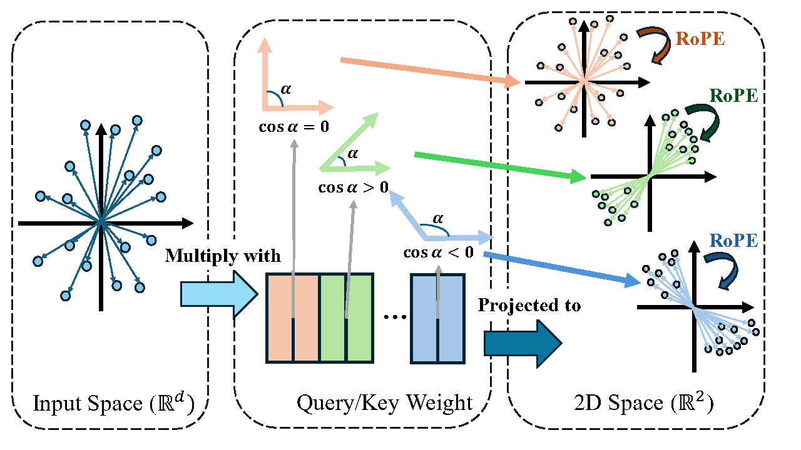

# What Rotary Position Embedding Can Tell Us

This is the official implementation of the NeurIPS 2024 paper "**What Rotary Position Embedding Can Tell Us:
Identifying Query and Key Weights Corresponding to
Basic Syntactic or High-level Semantic Information**"

## A Brief Introduction of This Paper

The widely used Rotary Position Embedding (RoPE) in large language models (LLM) encodes the position inforamtion by rotating **2D vectors** corresponding to pairs of elements in the query and the key in self-attention.
For each 2D vector, the two elements are the inner product of the input and two corresponding weight vectors.

In this paper, we show that the direction of the 2D vector is largely influenced by the angle between the two weight vectors. Non-orthogonal weight vectors would lead to a more fixed 2D vector direction regardless of the input while orthogonal weight vectors would lead to a more flexible 2D vector regarding the input.
Since the direction of the 2D vector is associated with the token position in RoPE, it indicates non-orthogonal weight vectors would lead to higher attention on certain position, insensitive to the input.
By aligning our empirical observations with previous works, we further associate the non-orthogonal weight vector pairs with the processing of syntactic information and associate orthogonal weight vector pairs with the processing of semantic information.



Furthermore, we notice that LLM fine-tuning mainly modify orthogonal weight vector pairs, which is reasonable since fine-tuning mainly changes how LLMs process semantic information. 
We propose a simple and effective method called Angle-based Weight Selection (AWS) as a plug-in that reduce the number of trainable parameters during fine-tuning and boost the performance after fine-tuning at the same time. 

In this repo, we provide our implementation of our proposed method AWS.

## Quick Start

### Requirements
We implement our method using backward hooks in Pytorch to mask the gradient during fine-tuning. There is not a specific requirements for our proposed method. 
We provide two demos based on the repo [LoftQ](https://github.com/yxli2123/LoftQ) and the repo [alpaca-lora](https://github.com/tloen/alpaca-lora) where each repo has its own requirements.
To install the required package 
`pip install -r requirements.txt`.

### Quick run

We provide our implementation based on [LoftQ](https://github.com/yxli2123/LoftQ) and [alpaca-lora](https://github.com/tloen/alpaca-lora) in the directory `LoftQ` and `alpaca-lora`. We provide scripts such as `alpaca-lora\mask.sh` and `LoftQ\mask_gsm8k.sh`. 

To run the code, one may specify the arguments required by the original code with **one additional argument ``mask_threshold``** which determines the threshold for WPGM to decide whether masking the gradient of the weight vector or not.

## Applying AWS to Your Own Code

Generally, the method is a plug-in for any fine-tuning framework of LLMs with RoPE. Currently, we provide implementation for `LoRA` in the `peft` package.
The main code is provided in `AWS.py`, where `register_mask_hook` register backward hooks masking the gradient and `remove_hooks` removes the hooks.

To apply AWS to a fine-tuning framework is simple. Before peft fine-tuning, register the hooks with

```handle_dict = register_mask_hook(model, model_name_or_path,  threshold=mask_threshold)```

and remove the hooks after fine-tuning with

```remove_hooks(handle_dict)```